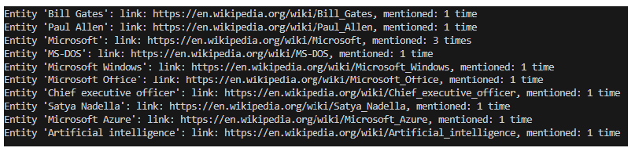

# AI Natural Language
AI Language - sentiment, text analysis, key phrases, entities, linked entities, QnA ...

# Screenshot
## Sentiment analysis

**Content to be analyzed:**
Enjoyed the vibrant energy and iconic attractions in Las Vegas,  but found the overall service quality lacking. 
Nonetheless, the unique charm of the city made for an unforgettable experience.

__Result:__

## Linked entities recognition

**Input**
Founded in 1975 by Bill Gates and Paul Allen, Microsoft quickly became a tech giant, achieving early success with 
MS-DOS and Windows. Dominating the '90s with Microsoft Office, the company faced antitrust challenges but adapted 
to the internet era. Under CEO Satya Nadella's leadership since 2014, Microsoft embraced cloud computing with Azure 
and ventured into mobile. Recent innovations in AI, cloud solutions, and collaboration reflect Microsoft's commitment 
to shaping the future of technology, cementing its legacy as a global tech powerhouse.

__Input and result:__ 

# Description

The application provides AI features for language processing

- sentiment analysis
- text analysis
- QnA marker
- language detection
- and more

# Tools 

AI, Azure AI Language service, Cloud, Python, C#...

# Installing

install vs code (if necessary)
Azure AI Language SDK

# Authors

@Ideaslink

# Acknowledgement

Azure AI

# Version history
version 1.0.0.1

# License
MIT

