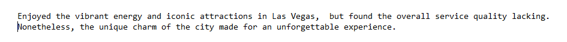
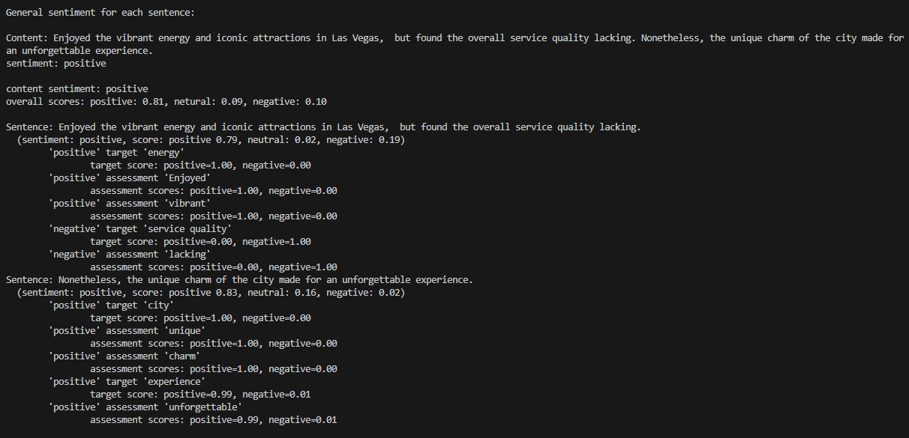

# AI Natural Language
AI Language - sentiment, text analysis, QnA ...

# Screenshot

# Description

The application provides AI features for language processing

- sentiment analysis
- text analysis
- QnA marker
- language detection
- and more

# Tools 

AI, Azure AI Language service, Cloud, Python, C#...

# Installing

install vs code (if necessary)
Azure AI Language SDK

# Authors

@Ideaslink

# Acknowledgement

Azure AI

# Version history
version 1.0.0.1

# License
MIT

